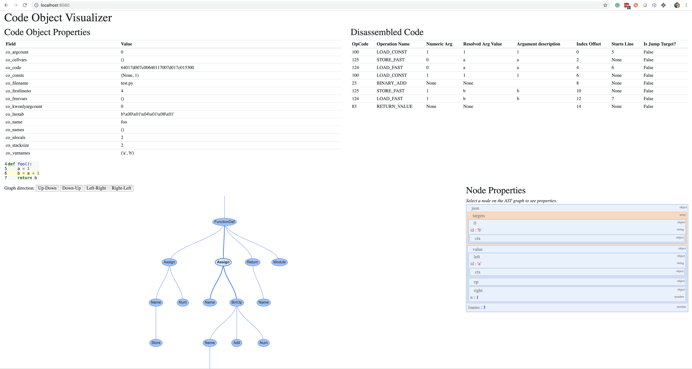

# instaviz
Instant visualization of Python AST and Code Objects.

## Installation

Requires modern Python 3.6+

```bash
pip install instaviz
```

## Usage

Instaviz is designed to be used like PDB, it will start a webserver when the `show()` function is called. Simply pass a class or function to be displayed

```python
def my_function():
    # your code
    ...

# your code
import instaviz; instaviz.show(my_function)

```



You can also run instaviz inside the Python REPL.

```bash
[GCC 7.3.0] :: Anaconda, Inc. on linux
Type "help", "copyright", "credits" or "license" for more information.
>>> import instaviz
>>> def fib(n):
...     a, b = 1, 1
...     for i in range(2, n + 1):
...         a, b = b, a + b
...     return b
... 
>>> instaviz.show(fib)
Bottle v0.12.17 server starting up (using WSGIRefServer())...
Listening on http://localhost:8080/
Hit Ctrl-C to quit.

```

## Credits

This package bundles some 3rd party javascript libraries. All libraries are bundled in the package so that the WebUI doesn't need to make any requests to the internet to protect the privacy of your code.

[json2html](https://json2html.com/)
[json2html-visualizer](http://visualizer.json2html.com/)
[visjs](http://visjs.org/)
